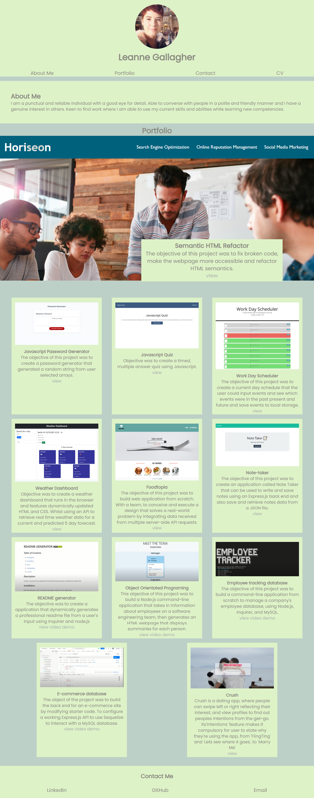

# PORTFOLIO 

## TABLE OF CONTENTS 
- [Description](#DESCRIPTION)
- [Screenshots](#SCREENSHOTS)
- [Links](#LINKS)
- [Installation](#INSTALLATION)
- [Contact](#CONTACT)

## DESCRIPTION

Objective was to create a portfolio for our various boot-camp projects.

## SCREENSHOTS

The following image shows the web application's appearance and functionality on a laptop:

The following image shows the web application's appearance and functionality on a mobile device:

## LINKS

Click [here](https://lenny-g.github.io/portfolio/) for finished webpage.

## CONTACT
 
If you would like to contact me regarding this project please reach out to me either on 
[LinkedIn](https://www.linkedin.com/in/leanne-gallagher/) or [GitHub](https://github.com/lenny-g)
